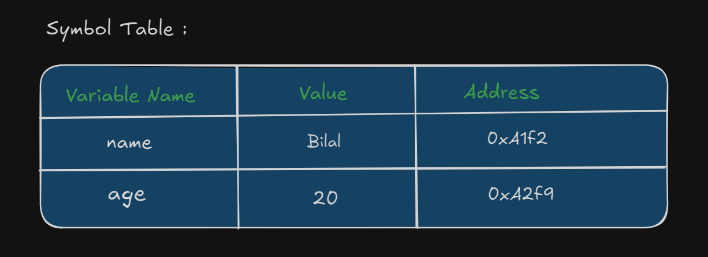

# Pointers in C++

# 🏠 The Story of Bilal’s House in Pakistan & Ali’s Jealous Plan

Bilal built a beautiful home in Islamabad, Pakistan, and shared pictures of it on the internet. People appreciated his house, and one boy named Ali was especially impressed. Ali messaged Bilal online, asking for the home design so he could build a similar one.

Bilal kindly shared the design. Within five months, Ali successfully built the same house.

However, Ali became jealous. He wanted his house to be unique — the only one of its kind in the world. So, he decided to destroy Bilal’s house.

To do this, Ali needed Bilal’s home address. He had two options:

🔍 Option 1: Search One-by-One

Ali could visit every house in Pakistan, searching for Bilal’s home.

- This method could take a long time — 2 years, 5 years, or even more.
- It's slow but doesn't require help from Bilal.

📬 Option 2: Ask Directly

Ali could contact Bilal and ask for his address.

- If Bilal gave his address, Ali could find and destroy the house within a few hours or days, depending on the distance.

- This method is faster but depends on Bilal sharing the information.


---

**🧠Note : If you want to access something, you need address.**

---

## 🧩 Programming Analogy of the Story  
### 🔨 Real Life vs RAM Memory

---

| Real World (Story)                              | Programming (Computer RAM)                             |
|--------------------------------------------------|---------------------------------------------------------|
| Bilal builds a house in Islamabad               | You declare a variable like `int name = "Bilal";`       |
| House is placed at a location (address)         | Variable is stored at a memory address in RAM           |
| Ali wants to destroy Bilal’s house              | You want to access the value stored in that variable     |
| Ali needs Bilal’s house address to do that      | CPU needs the memory address to access the variable      |
| Ali uses Symbol Table (contacting Bilal)        | CPU uses the **Symbol Table** to find the variable's address |

---

## 🧬 Visual Explanation:

### 🏠 Real World:

Bilal's Home = "Beautiful House"

Located at → Islamabad, House #123 (address)

Ali wants to destroy → needs address

### 💾 RAM:

int name = "Bilal";

int age = 20;

---



---

To access "Bilal", the program checks the symbol table to find the memory address (0xA1F3).

## Conclusion :

- In RAM, the value of a variable is stored.
- To access this value, the program (or compiler) must use its memory address, which is mapped from the variable name via the symbol table.
- The compiler uses the symbol table to find the address of a variable name.

---

## 4GB RAM

- A 4GB RAM has **2³² bytes**, and each memory block holds **1 byte**.
- RAM is **byte-addressable**, meaning **each byte has a unique address**.
- The **address size (or length)** must be **32 bits** to address 2³² bytes.
- The **size of the address bus** depends on the **addressable memory size**.
- The `int` data type typically takes **4 bytes** (in most 32-bit or 64-bit systems).

---

## 🧠 Understanding Variable Addresses and Pointers in C++

When you create a variable in C++, it's stored somewhere in the computer's memory (RAM). Each variable has a memory address that indicates where in memory it is stored.

---

## 📍 How to Find a Variable's Address

You can find the address of a variable using the address-of operator (&):

```
int x = 10;
std::cout << &x;  // Prints the memory address of x in hexadecimal format
```

---

## 💡 What Is a Pointer?

A pointer is a variable that stores the address of another variable.

```
int x = 10;
int* ptr = &x;    // 'ptr' now holds the address of 'x'

std::cout << ptr;   // Prints the address stored in ptr (same as &x)
std::cout << *ptr;  // Dereferences the pointer to get the value of x (10)
```

---

### 🧪 Quick Pointer Concepts

| Concept              | Example     | Meaning                                  |
|----------------------|-------------|------------------------------------------|
| Address-of (`&`)     | `&x`        | Gets the address of variable `x`         |
| Pointer declaration  | `int* ptr;` | Declares a pointer to an `int`           |
| Pointer assignment   | `ptr = &x;` | Stores the address of `x` in `ptr`       |
| Dereferencing (`*`)  | `*ptr`      | Gets the value stored at the address     |

---

## 🧷 How to Make a Pointer in C++

✅ Step-by-step:

1. Create a normal variable
This variable will hold a value in memory.
```
int age = 20;
```
2. Create a pointer
A pointer is declared using the * symbol. It stores the address of another variable.
```
int* ptr = &age;
```
- int* means "pointer to int"
- &age gives the address of the variable age
- ptr stores that address
3. You can now use the pointer:
```
std::cout << ptr;   // Prints the address of age
std::cout << *ptr;  // Dereferences the pointer: prints 20
``` 

---
## 🧮 What Is the Size of a Pointer?

✅ Correct Explanation:

The size of a pointer does not depend on:

- The data type it points to (int, float, char, etc.)
- Instead, it depends on the system architecture:

| Architecture | Pointer Size |
|--------------|--------------|
| 32-bit       | 4 bytes      |
| 64-bit       | 8 bytes      |


✅ So:

- On a 32-bit system, a pointer is typically 4 bytes
- On a 64-bit system, a pointer is typically 8 bytes

```
int age = 20;
int* ptr = &age;

std::cout << sizeof(ptr);  // Output: 8 on a 64-bit system
```

---

## ✅ Why Do We Need to Mention the Data Type When Creating a Pointer?

🧠 Short Answer:
Because the pointer needs to know how many bytes to read or write when it's dereferenced (*ptr), and that depends on the data type it points to.

### 📊 Example Table

| Data Type | Size (Typical) | Meaning for Pointer     |
|-----------|----------------|--------------------------|
| `int`     | 4 bytes         | Read/write 4 bytes       |
| `char`    | 1 byte          | Read/write 1 byte        |
| `float`   | 4 bytes         | Read/write 4 bytes       |
| `double`  | 8 bytes         | Read/write 8 bytes       |


🧾 Explanation:
When you declare a pointer like this:
```
int* ptr;
```

You're telling the compiler:

"This pointer will point to an int, so when I dereference it (*ptr), give me 4 bytes starting from the address it holds."

Same goes for other data types:
```
char* cptr;  // Will only access 1 byte
double* dptr; // Will access 8 bytes
```

⚠️ Why This Matters:
Without knowing the type, the compiler wouldn’t know:

- How much memory to access
- How to perform pointer arithmetic (ptr + 1 should move by 4 bytes for int*, 1 byte for char*, etc.)

---
## 🖨️ How to Print the Value Stored at the Pointer's Address?

✅ Example:
```
int age = 20;
int* ptr = &age;

std::cout << ptr;   // 👉 Prints the address of the variable 'age'
std::cout << *ptr;  // 👉 Prints the value stored at that address (20)
```


---
## 🔄 Updation of a Pointer

```
int* ptr;         // Pointer declared, currently holds a garbage or null value
int age = 20;
ptr = &age;       // Now ptr points to 'age'

int num = 80;
ptr = &num;       // Now ptr is updated to point to 'num'
```

🧠 Explanation:

- ptr is a pointer to an int.
- Initially, it's uninitialized (may hold a garbage address).
- Then it's assigned the address of age.
- Later, it's updated to point to num instead — this is called pointer reassignment.

📌 Key Points:

- A pointer can be updated to point to any variable of the same data type.
- After reassignment, it no longer refers to the previous variable.
- *ptr will give the value of whatever variable it currently points to.


